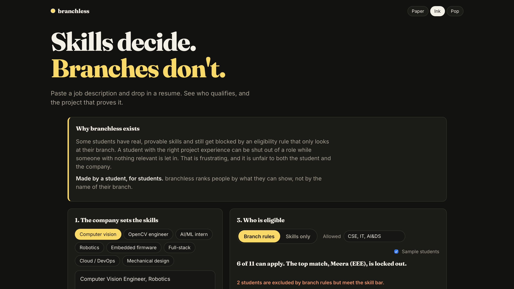

# SKILL-MATCH

### Your branch shouldn't decide what you're capable of.

> Stop filtering students by what they study. Start matching them by what they can prove.

## 📸 Preview



## 🚀 Live Demo

[Try Skill-Match](https://skill-match-sand.vercel.app)

## 💡 The Idea

Traditional eligibility:

```text
Degree → Branch → Eligibility → Rejection
```

Skill-Match:

```text
Skills → Evidence → Match → Opportunity
```

Skill-Match evaluates candidates based on the skills they can demonstrate rather than relying solely on degree-branch filters.

## 🔥 Evidence-Based Skills

| Level | Meaning |
|---|---|
| 🟢 VERIFIED | Skill is supported by actual project/code evidence |
| 🟡 CLAIMED | Student claims the skill |
| 🟠 LISTED | Skill only appears on the resume |
| ⚫ MISSING | No evidence found |

### The score comes from evidence. Not vibes.

## ⚙️ Current Prototype

- Job description skill extraction
- Resume analysis
- GitHub / portfolio proof
- Branch-based vs Skills-only eligibility
- Candidate scoring
- Verified / Claimed / Listed / Missing evidence
- CSV export
- Human-in-the-loop decision support

## 🧠 Core Principle

AI helps understand the information.

**The application calculates the score.**

Humans make the final decision.

---

### Made by a student, for students.

**Skill-Match — because your branch is only one line on your resume.**
