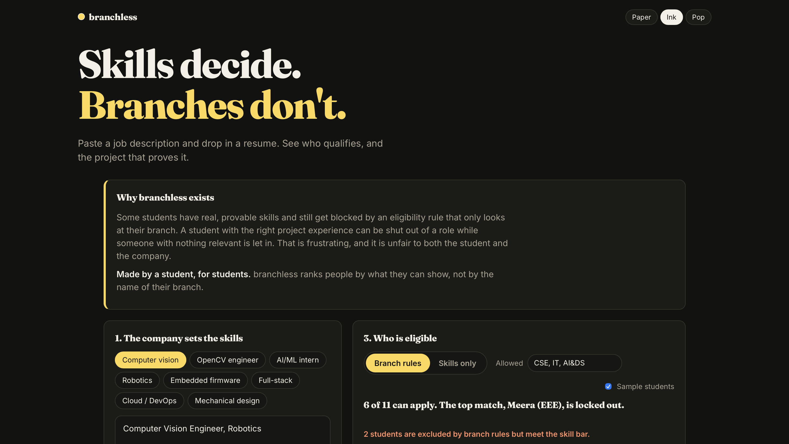
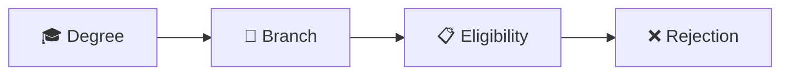
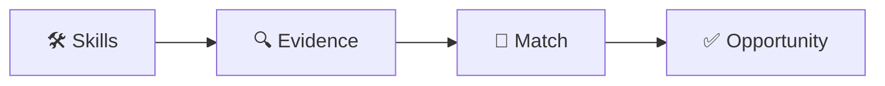
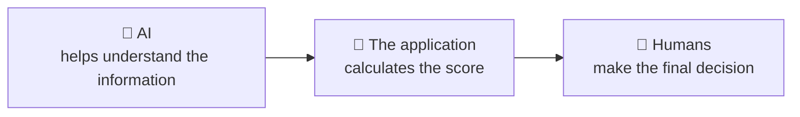

OWNER="Deepakk-06"
REPO="branchless"
cd ~/Desktop && rm -rf bl-edit
if ! git clone -q https://github.com/$OWNER/$REPO.git bl-edit; then
  echo "STOP: could not clone https://github.com/$OWNER/$REPO, check the owner and repo name"
else
cd bl-edit
cat > README.md <<'EOF'

# 🚫🌿 BRANCHLESS

### Your branch shouldn't decide what you're capable of.

**Stop filtering students by what they study.**
**Start matching them by what they can prove.**

---

## 💡 The idea

Traditional eligibility looks like this:

```mermaid
flowchart LR
    A["🎓 Degree"] --> B["🌿 Branch"] --> C["📋 Eligibility"] --> D["❌ Rejection"]
```

**Branchless** flips it:

```mermaid
flowchart LR
    A["🛠️ Skills"] --> B["🔍 Evidence"] --> C["🎯 Match"] --> D["✅ Opportunity"]
```

Branchless evaluates candidates on the skills they can **demonstrate**, rather
than relying solely on degree-branch filters.

## 🔥 Evidence-based skills

Every skill gets a level, and the level depends on the proof behind it.

| Level | Meaning |
| --- | --- |
| 🟢 **VERIFIED** | Skill is supported by actual project / code evidence |
| 🟡 **CLAIMED** | Student claims the skill |
| 🟠 **LISTED** | Skill only appears on the resume |
| ⚫ **MISSING** | No evidence found |

### The score comes from evidence. Not vibes.

## ⚙️ Current prototype

- 📄 Job description skill extraction
- 🧾 Resume analysis
- 🐙 GitHub / portfolio proof
- ⚖️ Branch-based vs Skills-only eligibility, side by side
- 📊 Candidate scoring
- 🟢🟡🟠⚫ Verified / Claimed / Listed / Missing evidence
- 📥 CSV export
- 🧑‍⚖️ Human-in-the-loop decision support

## 🧠 Core principle

```mermaid
flowchart LR
    A["🤖 AI<br/>helps understand the information"] --> B["🧮 The application<br/>calculates the score"] --> C["🧑 Humans<br/>make the final decision"]
```

AI helps understand the information.
**The application calculates the score.**
Humans make the final decision.

## 🚀 Try it

👉 **[branchlesss.vercel.app](https://branchlesss.vercel.app)**

---

## ⚠️ Developer's disclaimer

This started as a random idea born entirely out of frustration.

I had no real plan for how far it would go.
I just had the idea and kept pushing it further.

Somehow, it turned into this.

**How?**

Honestly, God knows.

I have no idea what possessed me to keep going, but here we are.

It works. That's all I'm saying.

**Please don't ask too many questions. I genuinely don't know either. 💀**

---

### Made by a student, for students.

**Branchless: because your branch is only one line on your resume.**

EOF
echo "--- files in repo ---"; ls
git add README.md
if git diff --cached --quiet; then echo "NOTHING TO CHANGE"
else git commit -qm "Rewrite README with diagrams and badges" && git push -q origin main && echo "DONE: README pushed"
fi
cd ~/Desktop && rm -rf bl-edit
fi
